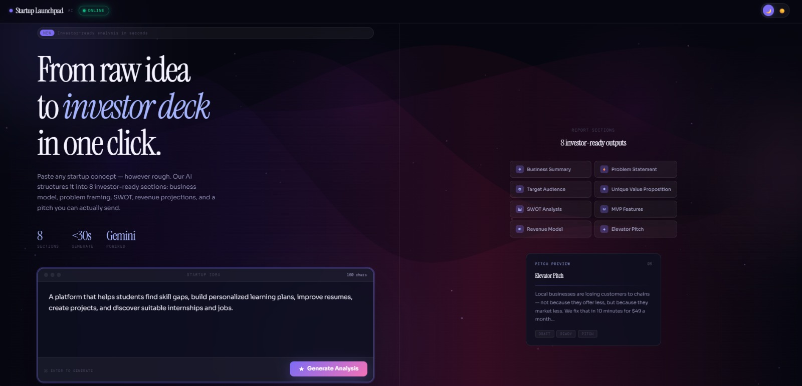
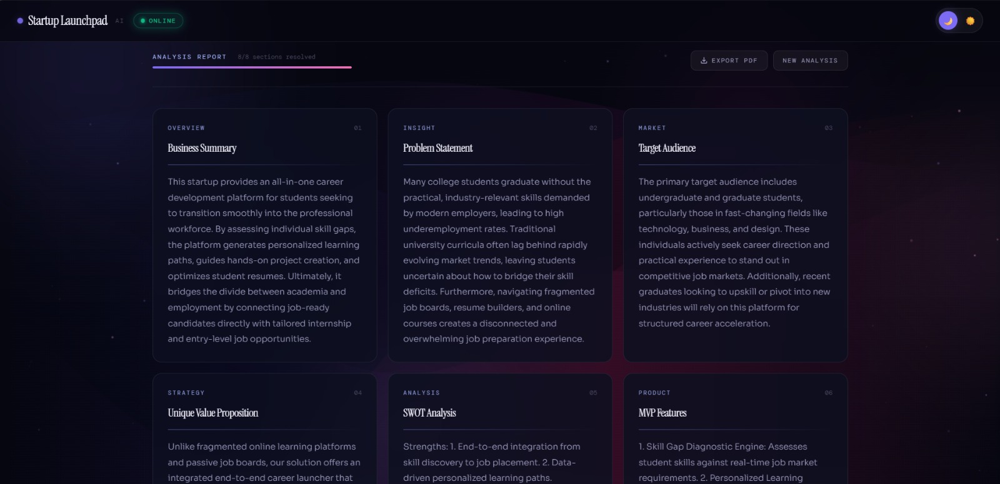
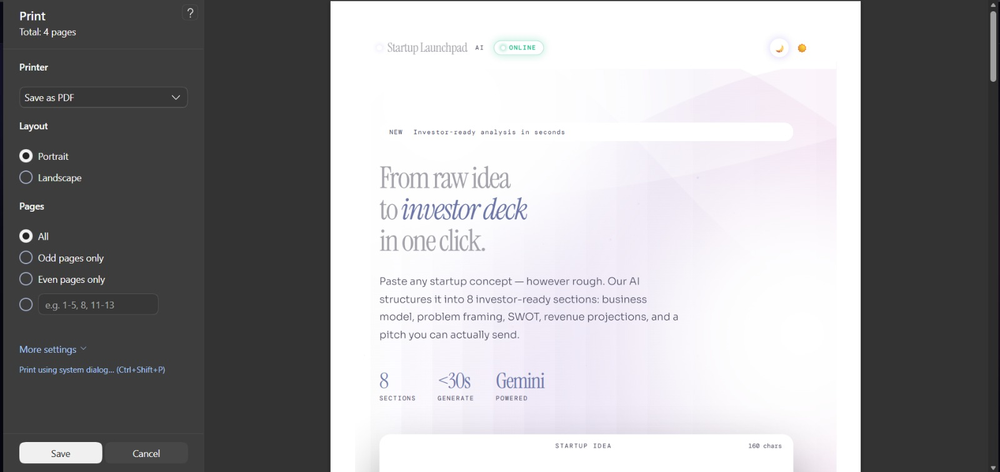

# AI Startup Launchpad

### Turn a startup idea into a structured business analysis in seconds.

AI Startup Launchpad is a full-stack AI application that transforms a raw startup idea into a structured startup analysis using Google's Gemini API.

Instead of manually researching a business idea from scratch, users can enter a simple startup concept and receive an organized analysis covering the problem, target audience, value proposition, SWOT analysis, MVP features, revenue model, and elevator pitch.

The application combines a FastAPI backend, Gemini AI integration, Server-Sent Events (SSE), and a responsive web frontend to deliver the analysis progressively.

---

## Live Application

**Live Website:**  
https://ai-startup-launchpad.netlify.app/

**Backend API:**  
https://ai-startup-launchpad.onrender.com

**API Documentation:**  
https://ai-startup-launchpad.onrender.com/docs

**GitHub Repository:**  
https://github.com/dakshita01/ai-startup-launchpad

---

# Overview

Turning an early-stage idea into a structured business concept usually requires market research, business planning, competitive analysis, product thinking, and financial modeling.

AI Startup Launchpad simplifies the initial ideation and validation process.

A user provides a startup idea such as:

> "A mobile platform that helps college students find affordable, verified tiffin services near their college."

The system sends the idea to Gemini and generates a structured startup analysis containing eight sections.

The result is displayed progressively in the browser and can be exported as a PDF report.

---

# What the Application Generates

For every startup idea, the system generates the following:

| Section | Description |
|---|---|
| Business Summary | Concise overview of the startup concept |
| Problem Statement | Core problem the startup is solving |
| Target Audience | Primary users and customer segments |
| Unique Value Proposition | What differentiates the product |
| SWOT Analysis | Strengths, weaknesses, opportunities, and threats |
| MVP Features | Essential features for the first product version |
| Revenue Model | Potential ways the startup can generate revenue |
| Elevator Pitch | Short, presentation-ready startup pitch |

The application displays the progress of these sections as they are delivered to the frontend.

---

# Product Preview

Add your screenshots inside a `screenshots` folder and uncomment the images below.

## Landing Page

<!--

-->

## Generated Analysis

<!--

-->

## Full Report

<!--

-->

Recommended screenshot structure:

```text
screenshots/
├── hero.png
├── analysis-report.png
└── full-report.png
```

---

# How It Works

The application follows this workflow:

```text
User enters startup idea
        |
        v
Frontend sends POST request
        |
        v
FastAPI backend receives idea
        |
        v
Backend sends ONE structured request to Gemini
        |
        v
Gemini generates all 8 sections
        |
        v
Backend validates structured response
        |
        v
Backend sends sections through SSE
        |
        v
Frontend progressively renders each section
        |
        v
User reviews / exports the analysis
```

---

# Architecture

```text
                    USER
                      |
                      v
          +-----------------------+
          |   Netlify Frontend    |
          | HTML / CSS / JavaScript|
          +-----------+-----------+
                      |
                      | POST /generate
                      v
          +-----------------------+
          |     FastAPI Backend   |
          |      Render Cloud     |
          +-----------+-----------+
                      |
                      | Gemini API
                      v
          +-----------------------+
          |    Google Gemini AI   |
          |  Structured Analysis  |
          +-----------+-----------+
                      |
                      | JSON response
                      v
          +-----------------------+
          | FastAPI Validation    |
          | Pydantic Schema       |
          +-----------+-----------+
                      |
                      | SSE Events
                      v
          +-----------------------+
          |   Browser Frontend    |
          | Progressive Rendering |
          +-----------------------+
```

---

# Important Engineering Decision: One Gemini Request

The application originally used multiple independent AI requests for the eight sections.

That approach created unnecessary API pressure and could hit Gemini free-tier rate limits.

The current implementation instead sends **one Gemini request** containing the startup idea and asks Gemini to return all eight sections as a structured response.

The backend then delivers those sections progressively to the frontend using Server-Sent Events.

```text
One User Request
       |
       v
One Gemini API Request
       |
       v
Structured JSON containing 8 sections
       |
       v
Backend
       |
       +----> Section 1 via SSE
       +----> Section 2 via SSE
       +----> Section 3 via SSE
       +----> Section 4 via SSE
       +----> Section 5 via SSE
       +----> Section 6 via SSE
       +----> Section 7 via SSE
       +----> Section 8 via SSE
```

### Why this architecture?

It provides several advantages:

- Reduces the number of Gemini API calls
- Reduces the probability of hitting request-per-minute limits
- Keeps the backend architecture simple
- Produces a predictable structured response
- Allows the frontend to render the report progressively
- Makes the application easier to reason about and maintain

### Important clarification

The application uses SSE for progressive delivery of the generated sections.

It is **not token-by-token Gemini streaming**.

Gemini generates the structured analysis in one request, after which the FastAPI backend sends the individual sections to the frontend sequentially through SSE.

---

# Key Features

## AI-Powered Startup Analysis

Users can enter almost any startup concept and receive a structured business analysis generated using Gemini.

## Eight-Part Business Framework

The generated analysis covers:

- Business Summary
- Problem Statement
- Target Audience
- Unique Value Proposition
- SWOT Analysis
- MVP Features
- Revenue Model
- Elevator Pitch

## Progressive Results

The backend uses Server-Sent Events to deliver sections progressively rather than waiting for the frontend to receive one large rendered response.

## Structured AI Output

Gemini is instructed to return a predictable structured response which is validated using Pydantic before being sent to the frontend.

## Quick Examples

The interface provides example startup ideas so users can immediately test the application.

## Dark / Light Theme

The frontend includes a theme toggle for a more flexible user experience.

## PDF Export

Users can export the generated startup analysis as a PDF report.

## Responsive Frontend

The interface is designed to work across desktop and smaller screen sizes.

## API Documentation

FastAPI automatically provides interactive API documentation through Swagger UI.

---

# Technology Stack

## Frontend

- HTML5
- CSS3
- JavaScript
- Fetch API
- Server-Sent Events / ReadableStream handling
- Responsive UI

## Backend

- Python
- FastAPI
- Uvicorn
- Pydantic

## Artificial Intelligence

- Google Gemini API
- `google-genai` Python SDK
- Structured JSON generation

## Deployment

- Netlify — Frontend
- Render — Backend
- GitHub — Source Control

---

# Dependencies

The backend currently uses:

```text
fastapi==0.141.1
uvicorn==0.52.4
google-genai==2.23.0
pydantic==2.13.5
```

---

# Project Structure

```text
ai-startup-launchpad/
│
├── backend/
│   ├── main.py
│   ├── requirements.txt
│   └── venv/
│
├── frontend/
│   ├── index.html
│   ├── style.css
│   └── script.js
│
├── screenshots/
│   ├── hero.png
│   ├── analysis-report.png
│   └── full-report.png
│
└── .gitignore
```

The virtual environment is intentionally excluded from Git using `.gitignore`.

---

# Backend API

The primary backend endpoint is:

```text
POST /generate
```

It accepts a startup idea and returns the generated analysis through a streamed response.

Conceptually, the request looks like:

```json
{
  "idea": "A platform that helps college students find affordable internships."
}
```

The backend processes the idea and generates the eight analysis sections.

---

# Structured Response

The backend uses a Pydantic model to define the expected AI response structure.

Conceptually:

```text
StartupAnalysis
│
├── business_summary
├── problem_statement
├── target_audience
├── unique_value_proposition
├── swot_analysis
├── mvp_features
├── revenue_model
└── elevator_pitch
```

This provides a predictable contract between the AI generation layer and the application backend.

---

# Server-Sent Events

Server-Sent Events are used to progressively send generated sections from the backend to the browser.

The frontend receives events containing information such as:

```json
{
  "section": "business_summary",
  "status": "success",
  "content": "..."
}
```

The browser then places the corresponding content into the correct report card.

This creates a more responsive user experience while keeping the backend implementation relatively lightweight.

---

# Local Development

## 1. Clone the repository

```bash
git clone https://github.com/dakshita01/ai-startup-launchpad.git
cd ai-startup-launchpad
```

## 2. Create the Python virtual environment

From the backend directory:

### Windows

```powershell
cd backend
python -m venv venv
```

Activate it:

```powershell
.\venv\Scripts\Activate.ps1
```

## 3. Install dependencies

```powershell
pip install -r requirements.txt
```

## 4. Configure the Gemini API Key

Create a Gemini API key using Google AI Studio.

The API key must never be committed to GitHub or placed inside frontend JavaScript.

For local PowerShell development:

```powershell
$env:GEMINI_API_KEY="YOUR_ACTUAL_API_KEY"
```

You can verify that the variable exists without printing the secret:

```powershell
if ($env:GEMINI_API_KEY) {
    "API key is set"
} else {
    "API key is NOT set"
}
```

---

# Running the Backend

From the `backend` directory:

```powershell
uvicorn main:app --reload --port 8000
```

The API will be available at:

```text
http://127.0.0.1:8000
```

FastAPI Swagger documentation:

```text
http://127.0.0.1:8000/docs
```

You can use `/docs` to test the `/generate` endpoint directly.

---

# Running the Frontend Locally

Open the frontend files using a local development server or VS Code Live Server.

The frontend should be configured to communicate with the local FastAPI backend:

```text
http://127.0.0.1:8000
```

Once both frontend and backend are running:

1. Open the frontend.
2. Enter a startup idea.
3. Click `Generate Analysis`.
4. Verify that the eight sections are populated.
5. Test PDF export.
6. Test the theme toggle.
7. Test the quick examples.
8. Try a second startup idea.

---

# Deployment

The application is deployed using two separate services.

```text
GitHub
  |
  +----------------------+
  |                      |
  v                      v
Netlify                Render
Frontend               Backend
  |                      |
  |                      v
  |                 Gemini API
  |                      |
  +------ HTTP ----------+
```

---

# Frontend Deployment — Netlify

The frontend can be deployed directly through Netlify.

The frontend contains:

```text
index.html
style.css
script.js
```

After deployment, the frontend must use the deployed Render backend URL instead of the local backend URL.

Production backend:

```text
https://ai-startup-launchpad.onrender.com
```

---

# Backend Deployment — Render

The FastAPI backend is deployed on Render.

Recommended Render configuration:

### Root Directory

```text
backend
```

### Build Command

```bash
pip install -r requirements.txt
```

### Start Command

```bash
uvicorn main:app --host 0.0.0.0 --port $PORT
```

### Environment Variable

```text
GEMINI_API_KEY
```

The Gemini API key is stored as a Render environment variable.

It is not included in the source code.

---

# Free-Tier Considerations

The project is designed to run using free-tier services for development, learning, portfolio demonstration, and college presentations.

Render's free service can sleep after a period of inactivity.

As a result, the first request after inactivity may take significantly longer because the backend needs to wake up.

This is a hosting limitation rather than an application failure.

Once the backend is awake, subsequent requests are generally faster.

---

# Security

API keys and credentials should never be placed inside:

```text
frontend/script.js
```

or committed to GitHub.

The project uses environment variables for the Gemini API key.

It is also recommended to keep environment files outside version control.

The repository `.gitignore` excludes:

```gitignore
.env
.env.*
!.env.example
```

It also excludes Python virtual environments and generated Python cache files.

---

# Git Workflow

The repository uses GitHub for source control and collaboration.

The recommended workflow is:

```text
main
 |
 +---- feature branch
          |
          v
       Changes
          |
          v
       Commit
          |
          v
       Push
          |
          v
    Pull Request
          |
          v
       Review
          |
          v
       Merge
          |
          v
         main
```

Team members can work independently on feature branches and submit pull requests before their changes are merged into `main`.

After a merge, the local repository can be synchronized using:

```powershell
git checkout main
git pull origin main
```

---

# Team Responsibilities

## Dakshita — Team Lead

Responsibilities:

- Backend development
- FastAPI architecture
- Gemini API integration
- Structured AI response design
- Server-Sent Events implementation
- API testing
- Deployment
- GitHub repository management
- Overall system integration

## Raunak — Frontend Development & UI/UX

Responsibilities:

- Frontend implementation
- UI/UX improvements
- Responsive design
- Startup analysis interface
- Frontend interaction logic
- Visual presentation

## Aman — Testing & Documentation

Responsibilities:

- Application testing
- Test cases
- Documentation
- Research support
- Presentation preparation

## Chanda — Research, Content & Presentation

Responsibilities:

- Startup/business research
- Content preparation
- Presentation support
- Project explanation
- Documentation assistance

---

# Engineering Highlights

The project demonstrates several practical software engineering concepts rather than being only an AI API wrapper.

### 1. Full-Stack Integration

The project connects:

```text
Frontend
   |
   v
FastAPI
   |
   v
Gemini API
   |
   v
Structured Response
   |
   v
SSE
   |
   v
Frontend Rendering
```

### 2. Structured AI Generation

Instead of relying on an unstructured block of text, the backend defines the expected analysis structure and validates the generated response.

### 3. API Rate-Limit Awareness

The architecture was designed around the limitations of free-tier AI API usage.

Moving from eight independent AI requests to one structured request significantly reduces API request pressure.

### 4. Asynchronous Backend Handling

The backend uses asynchronous FastAPI handling and executes the blocking Gemini SDK operation without blocking the main async event loop.

### 5. Progressive User Experience

The backend converts the structured AI result into sequential SSE events so that the frontend can progressively populate the report.

### 6. Separation of Concerns

The project separates:

```text
Frontend
Backend
AI Integration
Deployment
```

This makes the application easier to maintain and extend.

---

# Design Decisions

## Why FastAPI?

FastAPI provides:

- High-performance API development
- Native asynchronous support
- Pydantic integration
- Automatic API documentation
- Simple Python-based development

It is particularly suitable for an AI backend because Python has strong support across the machine learning and generative AI ecosystem.

---

## Why Gemini?

Gemini provides the generative AI capability required to transform a raw startup idea into structured business analysis.

The application communicates with Gemini through Google's modern `google-genai` Python SDK.

---

## Why Pydantic?

Pydantic provides schema validation for the generated startup analysis.

Instead of assuming that Gemini always returns exactly what the application expects, the backend defines an explicit structure.

This creates a stronger interface between:

```text
AI output
     |
     v
Pydantic validation
     |
     v
Application logic
```

---

## Why SSE?

Server-Sent Events are useful when the server needs to continuously send updates to the browser over a single HTTP connection.

For this application, SSE is used to send the eight completed analysis sections progressively.

This avoids requiring the frontend to repeatedly poll the backend for updates.

---

# Example Startup Idea

Example input:

```text
An AI-powered platform that helps college students find affordable internships by analyzing their skills, matching them with relevant opportunities, identifying skill gaps, and creating a personalized learning roadmap to become eligible for those internships.
```

The system can transform this idea into:

```text
Business Summary
Problem Statement
Target Audience
Unique Value Proposition
SWOT Analysis
MVP Features
Revenue Model
Elevator Pitch
```

This allows a raw concept to be converted into a more structured starting point for further research and validation.

---

# Testing

The application should be tested at multiple levels.

## Backend Testing

Use FastAPI Swagger UI:

```text
/docs
```

Test:

```text
POST /generate
```

with multiple startup ideas.

## Frontend Testing

Verify:

- Startup idea input
- Generate Analysis button
- Loading states
- Analysis section rendering
- Section completion state
- Theme toggle
- Quick examples
- PDF export
- Responsive layout
- Error handling

## Production Testing

After deployment, test:

```text
Netlify Frontend
        |
        v
Render Backend
        |
        v
Gemini API
```

The complete request flow should work without relying on the local development environment.

---

# Current Limitations

The application is primarily designed as a startup ideation and early business-analysis tool.

The generated output should not be treated as verified market research, financial advice, legal advice, or proof of product-market fit.

AI-generated business analysis should be validated using real customer interviews, market research, competitor analysis, financial modeling, and domain expertise before making actual business decisions.

The application also depends on third-party services:

- Google Gemini API
- Render
- Netlify

Free-tier hosting may introduce cold-start delays and service limitations.

---

# Future Scope

Potential improvements include:

- User authentication
- Saved startup analyses
- Database-backed project history
- Startup comparison
- Competitor research
- Market-size estimation
- AI-generated business model canvas
- AI-generated pitch deck
- Financial projections
- Investor-oriented reports
- Export to multiple formats
- Startup scoring
- Team collaboration
- Custom AI prompts
- Advanced market validation
- Persistent user workspaces

These features can be added incrementally without fundamentally changing the current frontend/backend separation.

---

# Project Value

AI Startup Launchpad demonstrates how a generative AI capability can be transformed into a usable software product.

The project combines:

```text
Generative AI
+
Backend API Development
+
Structured Data Validation
+
Asynchronous Programming
+
Server-Sent Events
+
Frontend Development
+
Cloud Deployment
+
Git/GitHub Collaboration
```

Rather than simply sending a prompt to an AI model, the application builds an end-to-end workflow around the model.

---

# Learning Outcomes

Through this project, the team worked with:

- FastAPI
- REST APIs
- Pydantic
- Gemini API
- Google GenAI SDK
- Structured AI responses
- Server-Sent Events
- Async Python
- JavaScript Fetch API
- Responsive frontend development
- Git and GitHub
- Pull requests
- Branch-based collaboration
- Netlify deployment
- Render deployment
- Environment variables
- API security fundamentals

---

# Repository

GitHub:

https://github.com/dakshita01/ai-startup-launchpad

---

# Live Demo

Frontend:

https://ai-startup-launchpad.netlify.app/

Backend:

https://ai-startup-launchpad.onrender.com

API Documentation:

https://ai-startup-launchpad.onrender.com/docs

---

# Disclaimer

AI Startup Launchpad is an educational and portfolio project designed to demonstrate the integration of generative AI with a full-stack web application.

The generated startup analysis is AI-generated and should be independently validated before being used for real-world investment, financial, legal, or business decisions.

---

# Team

Built as a collaborative student project by:

- Dakshita — Team Lead, Backend, AI Integration & Deployment
- Raunak — Frontend Development & UI/UX
- Aman — Testing, Documentation & Research
- Chanda — Research, Content & Presentation

---

## Final Project Architecture

```text
                         AI STARTUP LAUNCHPAD

                              USER
                                |
                                v
                     +----------------------+
                     |      NETLIFY         |
                     |      FRONTEND        |
                     | HTML / CSS / JS      |
                     +----------+-----------+
                                |
                                | HTTP POST
                                v
                     +----------------------+
                     |       RENDER         |
                     |      FASTAPI         |
                     |      BACKEND         |
                     +----------+-----------+
                                |
                                | ONE AI REQUEST
                                v
                     +----------------------+
                     |    GOOGLE GEMINI     |
                     |  Structured Output   |
                     +----------+-----------+
                                |
                                | 8-section JSON
                                v
                     +----------------------+
                     |      PYDANTIC        |
                     |     VALIDATION       |
                     +----------+-----------+
                                |
                                | SSE EVENTS
                                v
                     +----------------------+
                     |      FRONTEND        |
                     | Progressive Report   |
                     +----------+-----------+
                                |
                                v
                     +----------------------+
                     |     PDF EXPORT       |
                     +----------------------+
```

---

## Built With

**Python · FastAPI · Pydantic · Google Gemini · JavaScript · HTML · CSS · Server-Sent Events · GitHub · Render · Netlify**
